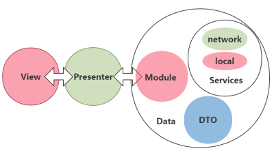

# README

[](http://www.apache.org/licenses/LICENSE-2.0.html) [](https://jitpack.io/#nekocode/kotgo) [](https://gitter.im/nekocode/kotgo?utm_source=badge&utm_medium=badge&utm_campaign=pr-badge&utm_content=badge)

## 快速创建项目
你可以使用下面的命令快速创建一个用 Kotgo 模板生成的项目。只需要粘贴到命令行中执行就可以了。
```bash
python -c "$(curl -fsSL https://raw.githubusercontent.com/nekocode/kotgo/master/project_creator.py)"
```
当然，你也可以将这个 Python 脚本下载到你本地运行。

## 相关文章
- [**『Android 还可以这样开发』 - 知乎专栏**](http://zhuanlan.zhihu.com/kotandroid)  

### 为什么使用 Kotlin
- [**#前言#**](http://zhuanlan.zhihu.com/kotandroid/20313799)
- [**#kotlin# 你好怪兽**](http://zhuanlan.zhihu.com/kotandroid/20314409)
- [**#kotlin# Activity 之朝花夕拾**](http://zhuanlan.zhihu.com/kotandroid/20349241)

### 为什么使用 MVP
- [**#android# MVP 的尝试**](http://zhuanlan.zhihu.com/kotandroid/20358928)

### 为什么使用 Rx
- [**#android# Everything is a stream**](http://zhuanlan.zhihu.com/kotandroid/20498267)
- [**#kotlin# 小心 Rx 的生命周期**](http://zhuanlan.zhihu.com/kotandroid/20514727)


## 描述
Kotgo 是一个采用 **MVP** 模式进行设计的 Android 应用框架。它使用 **kotlin** 和 java 混合构建。


### 包结构
```
com.nekocode.baseframework
├─ data
│  ├─ dto
│  ├─ exception
│  ├─ model
│  └─ service
│ 
├─ presentation
│  └─ screen_one
│     ├─ Presenter.kt
│     └─ Activity.kt
│
├─ App.kt
└─ Config.kt
```

### 分层
- **Data Layer：**非传统意义的 **Model** 层，包含 `dto`（Data Transfer Object）、`service`、`model`、`exception` 等。其中 service 包含 `Net` 等不同服务，用于从不同途径获取数据。model 负责处理某个业务对象的业务逻辑，并通过 **dto 或基本类型** 与 Presenter 层进行交互（建议使用 RxJava）。
- **View Layer：**视图层，包括各种 `activity`，`adapter`，`fragment`，`view`。只关注与用户交互，以及视图操作（动画、界面输出、更新等）。
- **Presenter Layer：**控制逻辑层。是**「Model 与 View 层中间的交互控制层」**。

### Kotlin
- **kotlin version: `1.0.0`**

### 依赖库
- anko: **`0.8.2`**
- rxkotlin: **`0.40.1`**
- retrofit: **`2.0.0-beta4`**
- picasso: **`2.5.2`**
- hawk: **`1.20`**
- otto: **`1.3.8`**

### 截图
感谢 **[gank.io](http://gank.io/)**。Sample App 是在它上面获取美女照片信息的。  


## 使用 Component Library
你可以仅仅使用 kotgo 的 component 库，在项目根目录的 build.gradle 添加以下内容：
```gradle
repositories {
    maven { url "https://jitpack.io" }
}
```

在你的 app 或其他 module 目录下的 build.gradle 添加以下依赖：
```gradle
dependencies {
    compile 'com.github.nekocode:kotgo:lastest-version'
}
```

### 一些特性
##### SingleFragmentActivity
它能帮助你快速创建一个只有单个 Fragment 的 Activity。它继承自 BaseActivity，你还可以使用 BaseActivity 提供的安全的消息处理函数。
```kotlin
class TestActivity : SingleFragmentActivity() {
    override val toolbarLayoutId = R.layout.toolbar
    override var toolbarHeight = 50

    override val fragmentClass = TestFragment::class.java
    override val fragmentBundle by lazy {
        intent.extras
    }

    override fun afterCreate() {
        toolbar.title = "This is a test"
        runDelayed({
            showToast("Hello")
        }, 2000)
    }

    override fun handler(msg: Message) {
    }
}
```

##### Base Presenter
它帮助你将 RxJava 绑定在 Avtivity 或者 Fragment 的生命周期上。它在页面 Destory 或者 Detach 的时候终止所有 Rx 的订阅。
```kotlin
class TestFragment : Fragment(), WeatherPresenter.ViewInterface {
    val weatherPresenter = WeatherPresenter(this)

    override fun onCreate(savedInstanceState: Bundle?) {
        super.onCreate(savedInstanceState)
        weatherPresenter.onCreate(arguments)
    }

    override fun onDetach() {
        super.onDetach()
        weatherPresenter.onDetach()
    }
}
```

##### 其他
它还包括 [KotterKnife](https://github.com/JakeWharton/kotterknife) 和一些使用 Kotlin 语法糖实现的拓展。你可以通过查看 `Sugar.kt` 获得更多的细节。
